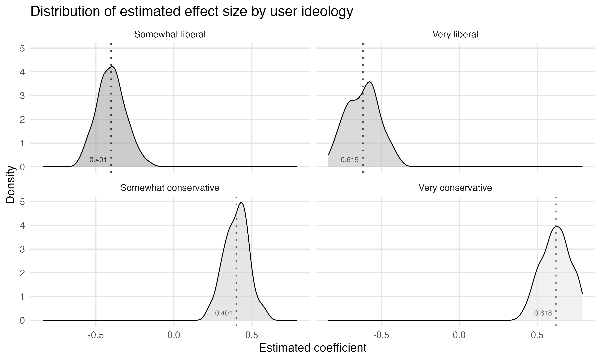

# smclonepr
Repo for smclone pre-registration/registered report materials

## Overview
This repository contains the code and data for a social media clone experiment designed to investigate the relationship between user political orientation and the attention they pay to politically-oriented social media content. The primary focus is to understand whether users are more likely to pay attention with posts that align with their political beliefs.

## Experiment Description

### Objective

The main objective of this experiment is to simulate user attention to social media content (tweets) and analyze the association between political orientation and paying attention to a tweet. 

Our key metric of attention is clicking "Read more" on a tweet. In the actual experiment, all tweets will be truncated. They will cue left-wing or right-wing opinion before the "Read more" text appears.

Users will be able to click on "Read more" 0 times or as many times as there are tweets (here: 200). And each user will have 120 seconds to scroll through and interact with posts. 

Posts only contain text--no other visual content.

### Design
1. **Participants**: Simulated users with varying political orientations, ages, genders, and social media usage frequencies.
2. **Tweets**: A set of 200 tweets, with equal numbers of left-wing and right-wing tweets.
3. **Interactions**: Simulated interactions where each user is exposed to tweets and decides whether to click "Read more".

### Methodology
1. **User Generation**:
   - 1000 users are generated with political orientations following a probability distribution designed to reflect fewer participants on the extremes and more in the middle categories.
   - Users have additional attributes such as age, gender, and social media usage frequency.

2. **Tweet Generation**:
   - 200 tweets are generated, with 100 left-wing and 100 right-wing.

3. **Simulating Interactions**:
   - Each user is assigned a number of interactions based on a Poisson distribution with a mean of 5.
   - Users interact with tweets with probabilities influenced by their political orientation. In this initial example (priors TBD) extremes are more likely to engage with aligned tweets and less likely with opposing tweets.

4. **Data Collection**:
   - The interaction data is collected, recording which tweets users click on.
   - A logistic regression model is used to estimate the effect of political orientation on the likelihood of interacting with conservative tweets.

### Analysis
- The logistic regression model analyzes the probability of engaging with conservative tweets based on user attributes.
- Mean effect sizes are calculated for different political orientation groups, and the results are interpreted in percentage probability terms.

## Repository Structure
- `data/processed/simulated_final_data.csv`: Combined final data from all simulation iterations.
- `plots/simulated_effect_sizes.png`: Plot showing the distribution of estimated effect sizes by user ideology.
- `simulate_estimand.R`: R script containing the code for the simulation and analysis.

## Code
The R script `simulate_estimand.R` includes:

1. **Libraries**: Loading necessary libraries (`tidyverse`, `broom`, `uuid`, `pbapply`).
2. **Parameters**: Defining the number of tweets, users, and the mean number of interactions per user.
3. **User and Tweet Generation**: Creating users and tweets with specified attributes and distributions.
4. **Simulating Interactions**: Assigning interactions based on user preferences and biases.
5. **Model Fitting**: Running logistic regression to estimate the effects of political orientation.
6. **Results Compilation**: Collecting and combining results from multiple simulation iterations.

## Output

The distribution of simulated effect sizes can be seen below:

